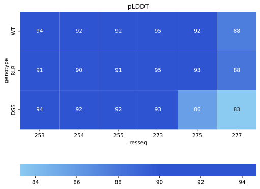

# AlphaFold prediction for Drosophila melanogaster CACNA2D3 a2d3 protein structure

This repository provides tools for visualizing the AlphaFold protein structure and pLDDT statistics. We showcase examples for the Drosophila melanogaster CACNA2D3 a2d3 wild-type protein, as well as its two mutant forms: loss-of-function mutations in the MIDAS motif in the vWA domain (DSS-AAA) and the arginine site (RLR-AAA). Please note that the exact impact of these mutations on protein structure still needs to be experimentally validated.


## Display the pLDDT colored protein structure

`alphafold_view.py`  library offers the capability to view and save pLDDT colored AlphaFold PDB files. It also allows for the marking of specific residue sites of interest.

``` r
show_pdb(
    pdb_filename,              # path of the PDB file to display
    style="cartoon",           # style of the main structure: "cartoon", "stick", "sphere"
    show_sidechains=False,     # show sidechains
    mutation_resseq=[],        # residue numbers of mutation to display
    mutation_style="sphere",   # style of the mutation site
    mutation_color="magenta",  # mutation site color
    width=800,                 # width of the view
    height=800,                # height of the view
)        
```

To use this library, do 

``` r
from alphafold_view import show_pdb
view = show_pdb(pdb_filename, mutation_resseq=mutation_resseq)
view.show()
```
where `pdb_filename` specifies the path of the PDB file that needs to be displayed, and `mutation_resseq` indicates the residue numbers of the mutation to be shown.


## Save the view

To save the view as a PNG:

1. Adjust the angle of the view created by executing the `show_pdb` function to your desired perspective.

2. Execute the `view.png()` function in a separate cell.

3. Right-click on the resulting image and select "Save As".

To view animation, do

```
view.zoomTo()
view.spin()
```

To save animation, run the following in a separate cell
```
view.apng(200)
```
where 200 is the number of frames you want to save. Right-click on the resulting animation in PNG and select "Save As".


For a complete demonstration of visualizing and saving the protein structure using `alphafold_view`, refer to the [`alphafold_view.ipynb`](./alphafold_view.ipynb) notebook.


## Show pLDDT statistics at the mutation sites

An illustrative demonstration of generating a heat map to visualize the average pLDDT values corresponding to specific residues is provided in the file [`plot_pLDDT.ipynb`](./plot_pLDDT.ipynb).



## Prerequisite

Need to install `py3Dmol`

`pip install py3Dmol`

## Reference

Zhang Y., Wang, T., Cai, Y., Cui, T., Kuah, M., Vicini, S., Wang, T., Role of α2δ-3 in Regulating Calcium Channel Localization at Presynaptic Active Zones during Homeostatic Plasticity, Frontiers in Molecular Neuroscience (2023)


## Support and Contribution
If you encounter any bugs while using the code, please don't hesitate to create an issue on GitHub here.
